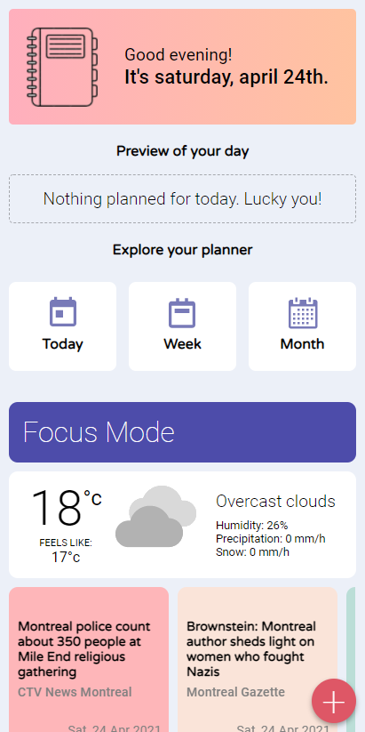
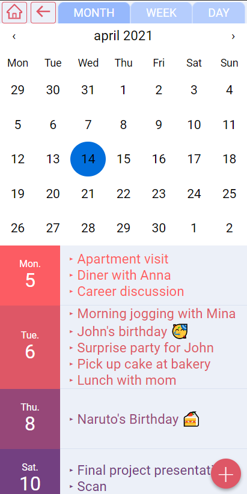
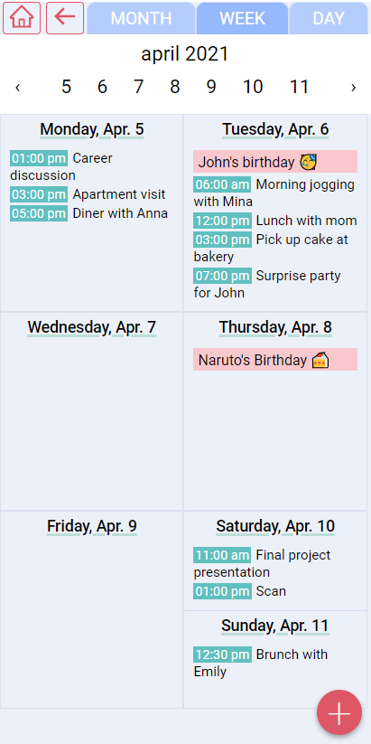
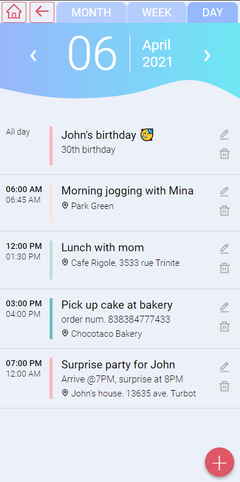

# Pink Planner - A customized planner application

# Introduction

Pink Planner is a React application that I developed while enrolled in a Full-stack web development bootcamp (Concordia University). The user can use the planner (month / week / day) to add, edit or delete events. The home page features a preview of the day's tasks, menu icons, the day's weather and a news feed.

The application was created with `create-react-app`, using `styled-components` for the styling and the animations. Events and meetings are stored on a MongoDB database. The technologies used include: HTML, CSS, JavaScript, React, Node, Express, RESTful API, MongoDB.

# Project features

The application allows the user to view meetings and events stored from a database.
The key features are:

- A tab-like component to switch between the different views.
- Three different date pickers to switch between months, weeks or days.
- In the day view, ability to edit or delete an event.
- On the homepage, some articles from GoogleNews API are fetched once per day and are displayed in a news feed.
- On the home page, the current weather is shown and is fetched from Weather API on every mount of the page.

The "+" button opens a form in a modal:

- Title, description, location
- Date pickers for the start and end date / all-day option
- Time pickers for the start and end time

  

# Project status

Features in development:

- Focus mode
- Responsive styling (all screen sizes)

# Packages, modules, APIs

- react-calendar ([react-calendar NPM](https://www.npmjs.com/package/react-calendar)): used in the month view and new event forms
- Weather API: [rapidapi.com/weatherbit/api/Weather](https://rapidapi.com/weatherbit/api/Weather)
- GoogleNews API: [rapidapi.com/newscatcher-api-newscatcher-api-default/api/Google%20News](https://rapidapi.com/newscatcher-api-newscatcher-api-default/api/Google%20News)
